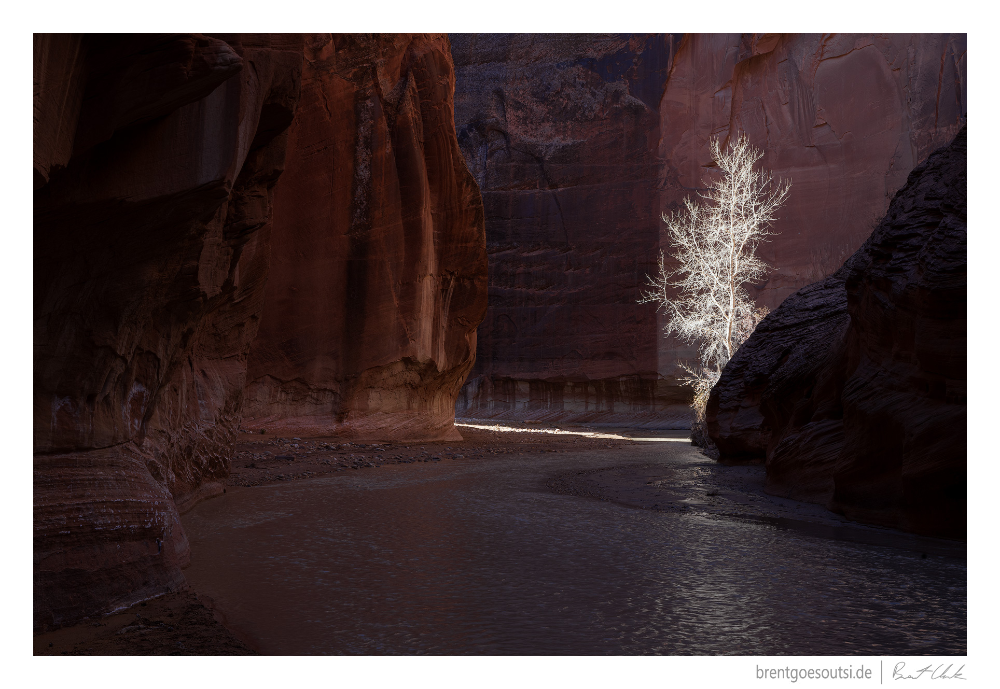
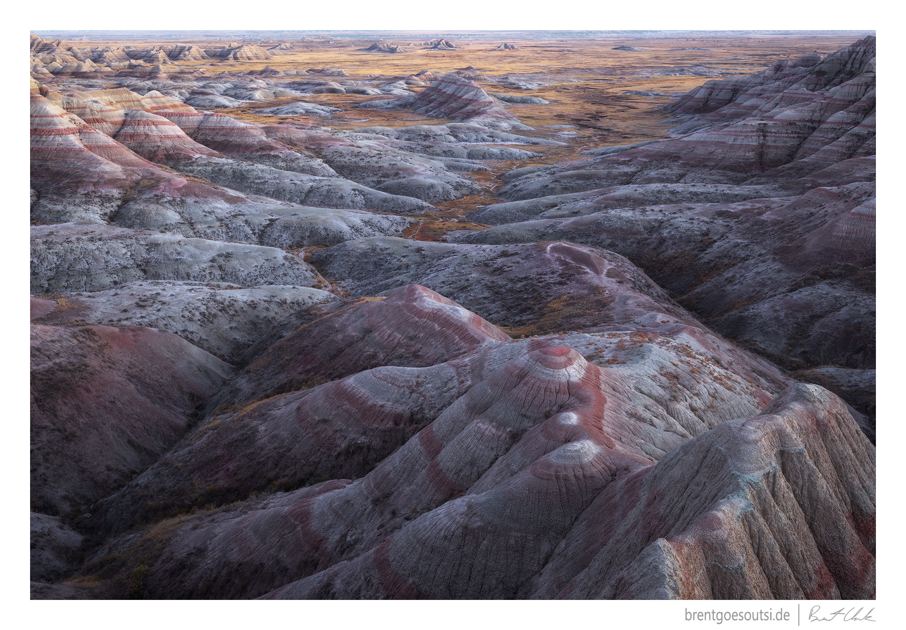
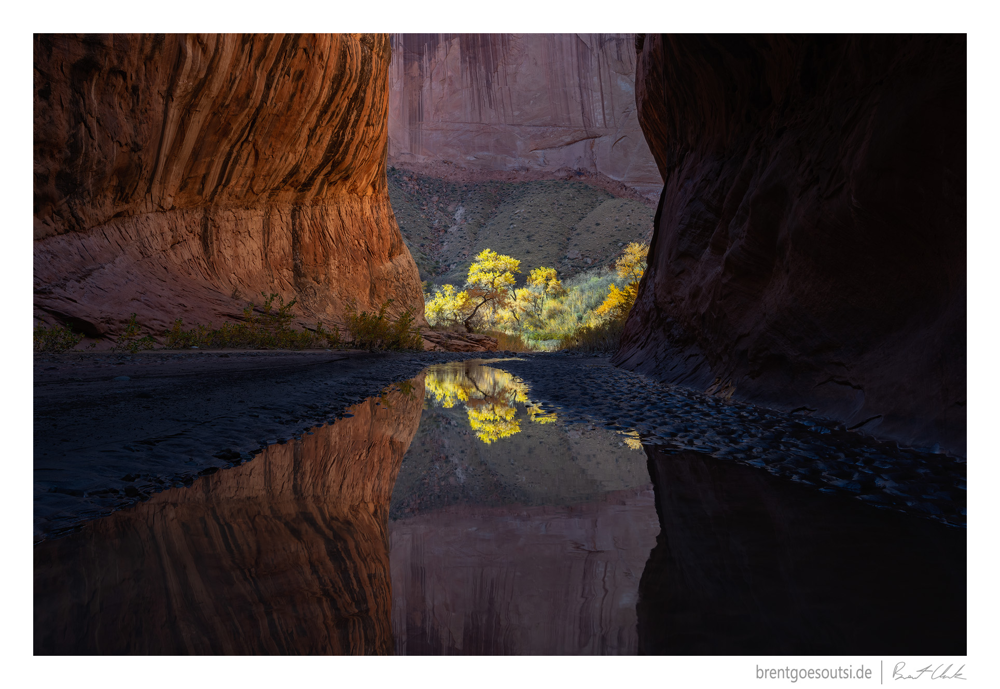
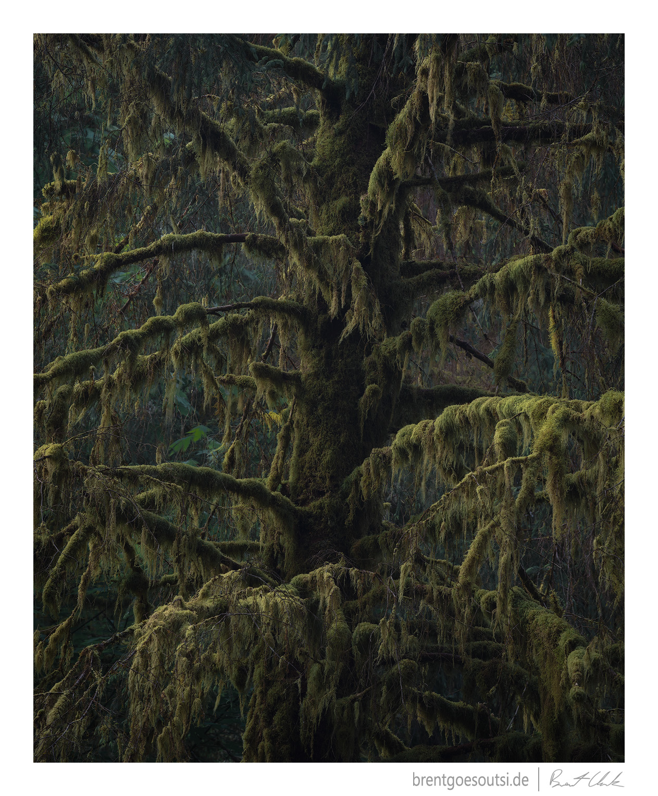
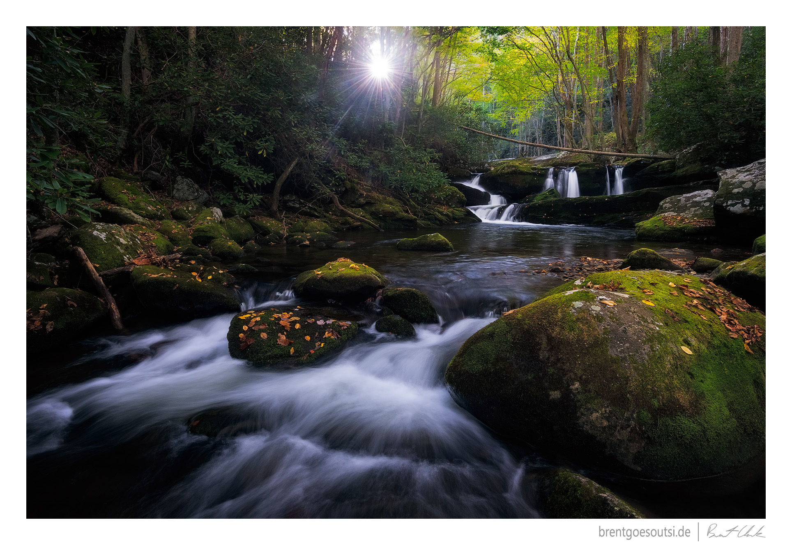
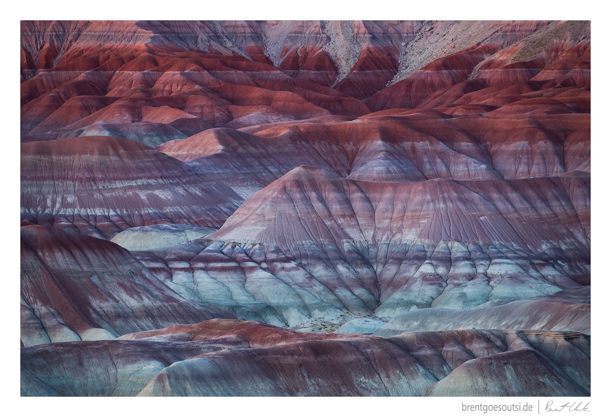
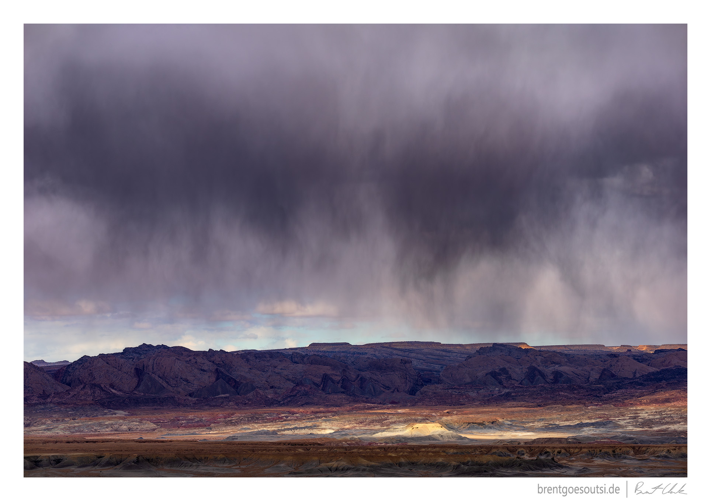
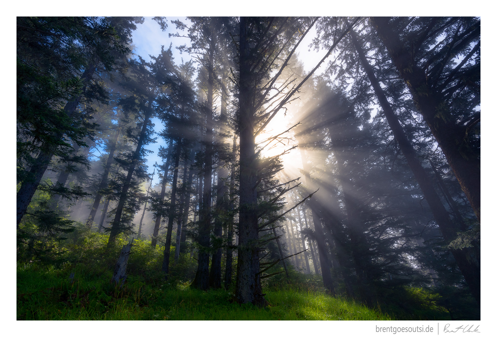
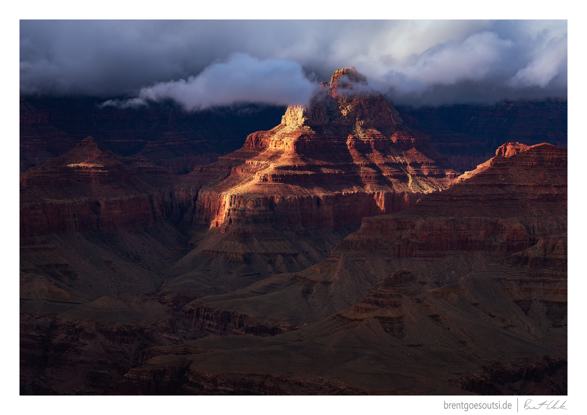

# Awe-Inspiration

I believe that regularly feeling a sense of awe and wonderment is an essential ingredient to living a good life.

The best way for me (and I suspect for most people) to continually feel these elevated feelings is to cultivate the appreciation of the natural events that occur every day. Of course, big and bold events like an incredible sunset, a colorful rainbow, a powerful weather system, or a divine celestial event are reliable ways to feel awe, but I contend that chasing only these events will lead to a lot of disappointment due to their rarity. Therefore, we should also work on developing a sense of awe at more mundane things like the shape of a gorgeous tree, an interesting play of light, the way a plant thrives in harsh conditions, or ancient geology. If we can do that, our lives with be richer for it.

The photographs in this gallery represent moments where my spirits lifted, my heart-rate increased, and I could do nothing but focus on what was unfolding in front of me.

*Updated: 2024-09-18*

---

Exactly

---

Amor Fati

---

Depth of Experience

---

Wilderness Medicine

---

Growing Shadows

---

The Practice

---

That Natural Glow

---

Labor of Luck

---

Conquer With Inaction

---

Boundless

---

Dream With Open Eyes

---

In the Midst

---

Last Time

---

ʻO ka Hale o Pele

---

Suchness

---

Cover

---

Brushed Lands

---

Even Flow

---

Dream Come True

---

Arterial

---

Dark Tranquility

---

Overlooked

---

Fresh New Look

---

Live Immediately

---

Commencement

---

Two Sides

---

Carved in Stone

---

How Long We Wait

---

Kairos

---

The Spirit Carries On

---

Temple

---

Icy Pilgrimage

---

Sleeping Giants
