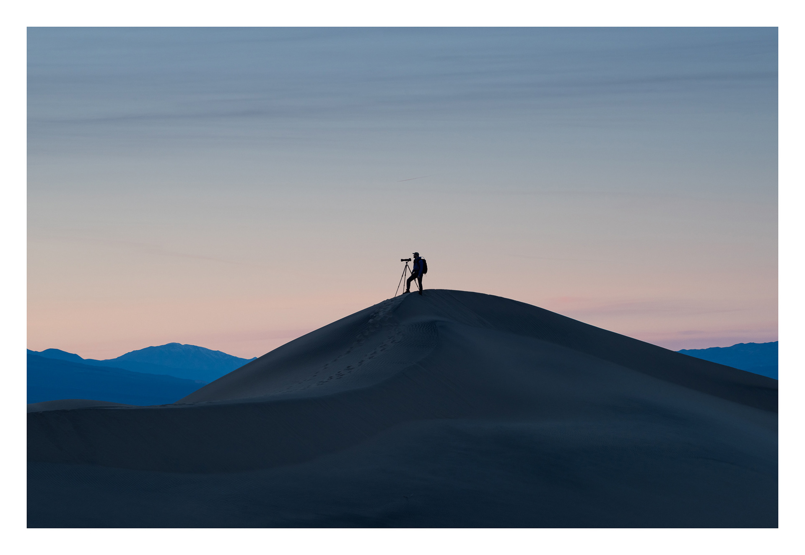
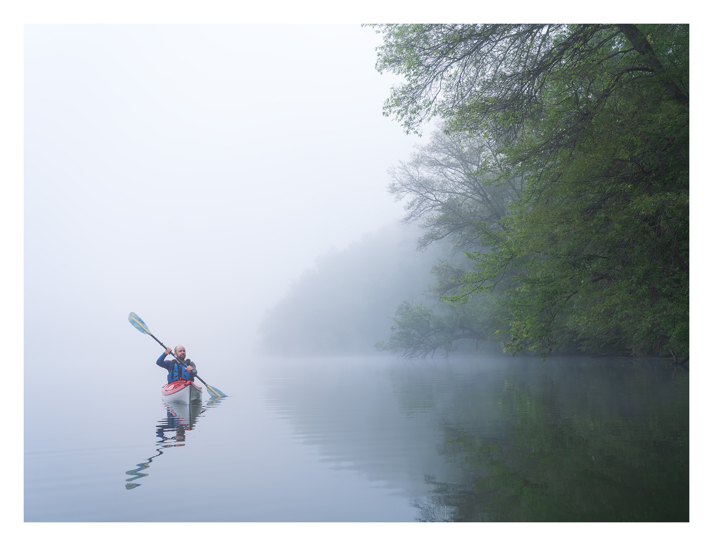

# Brent Goes Outside

### "Nature speaks all the time and is understood only by the sincere observer and heedful mind and heart.” – Te Kawa

*Photograph by [TJ Thorne](https://www.tjthornephotography.com/)*

---

Welcome and thank you for visiting my github page (you might also consider visiting [my actual website](https://brentgoesoutsi.de)). Here, you will find quiet, creative, and awe-inspiring nature photography that I created during my travels to distant natural places, as well as in my local area in the Upper Midwestern region of the United States.

Nature photography provides me with constant challenges that yield deep rewards in terms of personal growth and satisfaction. On a continual search for inspiration, I find myself driven to explore places, subjects, ideas, and emotions I'm not sure I would without a camera. Photographing the natural world has me continually reflecting on my place within it and how I want to convey its significance.

More practically, it can be incredibly fun and it keeps me in a healthy physical condition so that I can hike long distances and carry heavy equipment.

I've curated four collections of photographs with short descriptions that further describe a reason the craft itself makes my life more fulfilling. I invite you to take the time to go through each one to learn more about me. They can be found in the rest of this repository, but here are direct links as well:

- [QUIET](./Quiet/readme.md)
- [DISCOVERIES](./Discoveries/readme.md)
- [HOMELAND](./Homeland/readme.md)
- [AWE-INSPIRATION](./Awe-Inspiration/readme.md)

If you visit [my actual website](https://brentgoesoutsi.de), you can find hundreds more photos in [my archives](https://brentgoesoutsi.de/archives), and [links to things](https://brentgoesoutsi.de/links) like my [email newsletter](http://bit.ly/bgonewsletter), social media, prints, other appearances, and more.

---

*Photograph by [Kevin Sink](https://kevinsink.wordpress.com/)*

---

### THE NATURE FIRST PRINCIPLES

- Prioritize the well-being of nature over photography.
- Educate yourself about the places you photograph.
- Reflect on the possible impact of your actions.
- Use discretion if sharing locations.
- Know and follow rules and regulations.
- Always follow Leave No Trace principles and strive to leave places better than you found them.
- Actively promote and educate others about these principles.

https://www.naturefirstphotography.org
